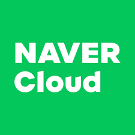

# FinBot-NCP

<picture>
  <source media="(prefers-color-scheme: dark)" srcset="./img/naver_cloud.png">
  
</picture>

2024 NAVER Cloud Platform Capstone Project. An AI-powered chatbot built on NCP services that analyzes financial statements and provides insights through natural language interactions.

## About

FinBot-NCP is a financial analysis chatbot that leverages RAPTOR's tree-structured retrieval methodology and extends it with metadata-based clustering for enhanced financial document analysis. This project builds upon the RAPTOR framework while incorporating ideas from FinRAG to better handle financial data.

### Key Features (Coming Soon)
- Tree-structured retrieval for financial documents
- Metadata-based clustering (by sector, company, year)
- Natural language processing of financial statements
- Integration with NCP services
- Interactive financial analysis capabilities

## Installation

```bash
git clone https://github.com/YourUsername/finbot-ncp.git
cd finbot-ncp
pip install -r requirements.txt
```

## Basic Usage (In Development)

```python
# Example code will be added as development progresses
```

### Setting Up with NCP (Coming Soon)
- NCP configuration steps
- API key setup
- Service integration details

## Project Structure
```
finbot-ncp/
├── src/                    # Source code
├── tests/                  # Test files
├── data/                   # Data processing scripts
├── models/                 # Model implementations
└── docs/                   # Documentation
```

## Features in Development
- [ ] RAPTOR integration for financial documents
- [ ] FinQA dataset preprocessing
- [ ] Metadata-based clustering implementation
- [ ] NCP service integration
- [ ] Financial analysis capabilities
- [ ] Interactive chat interface

## References
This project builds upon the following works:
- **RAPTOR: Recursive Abstractive Processing for Tree-Organized Retrieval**
  - [Original Repository](https://github.com/parthsarthi03/raptor)
  - [Paper](https://arxiv.org/abs/2401.18059)
  - Authors: Sarthi, P., Abdullah, S., Tuli, A., Khanna, S., Goldie, A., & Manning, C. D.

- **FinRAG: A Retrieval-Based Financial Analyst**
  - Authors: Chawla, K., & Naliath, A.
  - Department of Computer Science, Stanford University

## Contributing
Contributions are welcome! Please feel free to submit a Pull Request.

## License
This project is licensed under the MIT License - see the [LICENSE](LICENSE) file for details.

## Acknowledgments
- NAVER Cloud Platform
- Original RAPTOR team
- Stanford CS Research Team behind FinRAG
